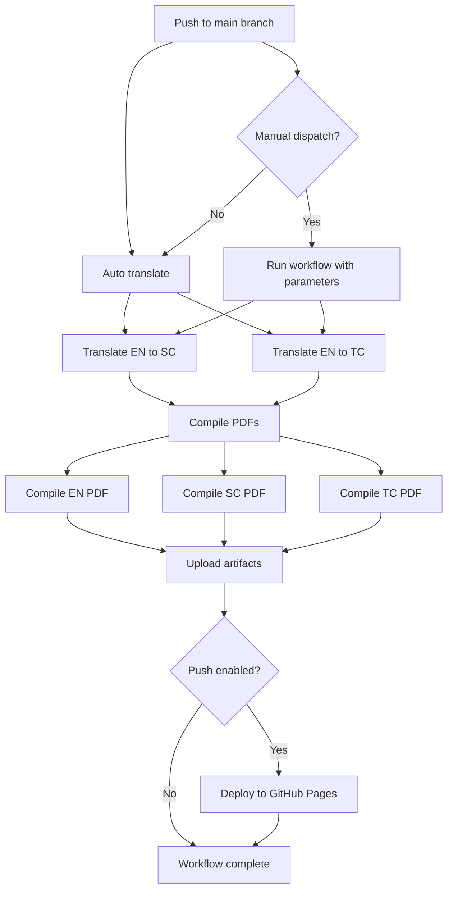

# CyberPlaza 白皮书项目

CyberPlaza 白皮书项目是一个用于管理 CyberPlaza 项目官方文档的自动化系统，提供多语言支持、自动翻译和编译流程，确保文档的一致性和可维护性。

### 核心价值
- **自动化翻译**：减少手动翻译的工作量和错误
- **版本控制**：所有文档变更都通过 Git 进行管理
- **多语言同步**：确保所有语言版本的内容一致性
- **自动部署**：编译后的 PDF 自动部署到 GitHub Pages
- **灵活扩展**：支持多种翻译后端和定制化配置

## 项目结构

```
cyberplaza_docs/
├── cyberplaza_whitepaper/        # 白皮书主目录
│   ├── mainmatter/              # 英文原始内容
│   ├── mainmatter_sc/           # 简体中文翻译
│   ├── mainmatter_tc/           # 繁体中文翻译
│   ├── appendix/                # 附录内容
│   ├── report_en.pdf            # 英文PDF
│   ├── report_sc.pdf            # 简体中文PDF
│   └── report_tc.pdf            # 繁体中文PDF
├── scripts/                     # 自动化脚本
│   ├── translate_sc.sh          # 英文→简体中文翻译
│   ├── translate_tc.sh          # 英文→繁体中文翻译
│   ├── compile_en.sh            # 编译英文PDF
│   ├── compile_sc.sh            # 编译简体中文PDF
│   ├── compile_tc.sh            # 编译繁体中文PDF
│   └── TRANSLATE_README.md      # 翻译脚本说明
└── .github/                     # GitHub Actions工作流
    ├── workflows/
    │   ├── translate-preview.yml
    │   └── translate-publish.yml
    └── ...
```

## 技术栈

| 技术/工具 | 用途 |
|---------|-----|
| LaTeX   | 文档编写和排版 |
| Bash    | 自动化脚本 |
| GitHub Actions | CI/CD 工作流 |
| Mermaid | 工作流程图绘制 |
| jq      | JSON 处理 |
| TeX Live | LaTeX 编译环境 |

## 核心功能

### 1. 多语言支持
- 英文 (EN)
- 简体中文 (SC)
- 繁体中文 (TC)

### 2. 自动化翻译
- 基于 GitHub Actions 的自动翻译工作流
- 支持多种翻译后端：
  - `doubao` - 豆包翻译接口
  - `openai` - OpenAI API
  - `github` - GitHub Copilot 后端
  - `test` - 测试模式（无网络请求）
- 自动将英文内容翻译为中文版本

### 3. 自动编译
- 自动将 LaTeX 源文件编译为 PDF
- 支持所有语言版本
- 编译结果作为 GitHub Actions 工件保存

## 使用方法

### 本地使用

#### 翻译内容
```bash
# 英文→简体中文
./scripts/translate_sc.sh

# 英文→繁体中文
./scripts/translate_tc.sh
```

#### 编译PDF
```bash
# 编译英文
./scripts/compile_en.sh

# 编译简体中文
./scripts/compile_sc.sh

# 编译繁体中文
./scripts/compile_tc.sh
```

### GitHub Actions 工作流

项目使用 GitHub Actions 实现完整的自动化流程：



#### 工作流细节：
1. **触发条件**：
   - 推送至 `main` 分支自动触发
   - 支持手动触发并指定参数

2. **翻译阶段**：
   - 并行翻译为简体中文 (SC) 和繁体中文 (TC)
   - 支持多种翻译后端选择

3. **编译阶段**：
   - 同时编译所有语言版本的 PDF
   - 使用 TeX Live 环境确保编译一致性

4. **部署阶段**：
   - 编译后的 PDF 作为 artifacts 保存
   - 自动部署到 GitHub Pages (gh-pages/docs)

### CI/CD 流程概览（当前配置）
- 发布流水线：`translate-publish.yml`
   - 触发：推送到 `main`，或手动 workflow_dispatch（参数：`dry_run` 默认 true、`api_type` 默认 doubao、`push` 默认 false）。
   - 依赖：`jq`、`texlive-xetex`、`texlive-latex-extra`、`texlive-lang-chinese`、`texlive-science`、`biber`、`fontconfig`。
   - Job 1 `translate_and_commit`：根据 `api_type` 选择翻译后端（默认为豆包，`DOUBAO_URL=https://ark.cn-beijing.volces.com/api/coding/v3`，模型从 `TRANSLATE_MODEL_SC/TC` secret 读取），执行 `translate_sc.sh` / `translate_tc.sh`；当 push 允许且有改动时用 `CYBERPLAZA_BOT_PAT` 推回 `main`。
   - Job 2 `compile_and_publish`：再次安装 TeX 依赖，执行 `compile_en.sh`、`compile_sc.sh`、`compile_tc.sh`，上传 `report_en/sc/tc.pdf` 为 artifact，并将 `cyberplaza_whitepaper` 与 `webpage` 内容发布到 `gh-pages/docs`（Pages 根路径为 `/docs/`）。生成的访问示例：`https://darrenhdc.github.io/cyberplaza_whitepaper_release/docs/report_en.pdf` 等。

- 预览流水线：`translate-preview.yml`
   - 触发：PR 的 opened/synchronize/reopened。
   - 逻辑：检测 `cyberplaza_whitepaper/mainmatter/*.tex` 改动，仅对改动文件运行翻译，强制 `API_TYPE=test`（不调用外部接口），编译 SC/TC 预览，上传 artifact，并在 PR 评论给出下载链接。

- 主要 Secrets（Actions 环境）：`DOUBAO_URL`（v3 路径）、`DOUBAO_KEY`、`TRANSLATE_MODEL_SC`、`TRANSLATE_MODEL_TC`、`CYBERPLAZA_BOT_PAT`（推回 main 时需要）、可选 `OPENAI_API_KEY`（若切换 openai 后端）；`GITHUB_TOKEN` 用于 Pages 发布。

### 翻译/编译行为速记
- 修改英文 `.tex` 并 push：流水线会自动翻译并编译 PDF，但生成的中文 `.tex` 只在 CI 工作区使用，不会自动提交回仓库；如需保留翻译结果，需手动提交。
- 修改中文 `.tex` 并 push：仍会触发编译，生成的 PDF 直接使用你提交的中文内容，英文未变时翻译环节基本不会产出新文件。
- 增量翻译（预览工作流）：仅对变更的英文章节做翻译；无改动的部分沿用缓存/上次结果。

## 贡献

1. 修改英文源文件 (`cyberplaza_whitepaper/mainmatter/`)
2. 自动翻译工作流将自动处理翻译
3. 检查翻译结果并进行必要的人工优化
4. 提交修改

## 许可证

请查看项目根目录的 LICENSE 文件。
